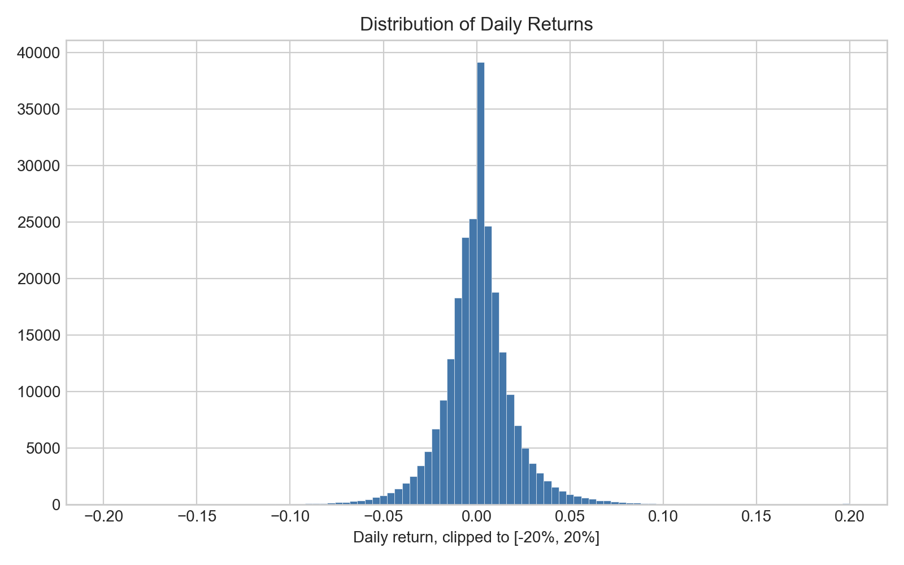
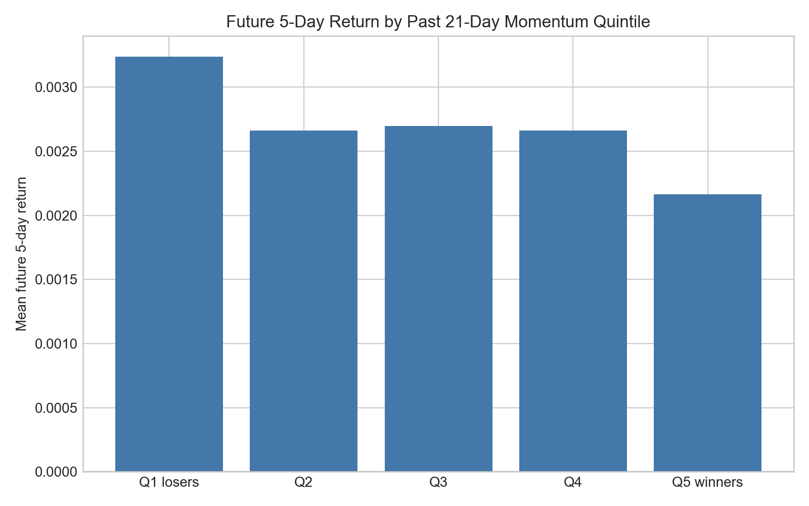
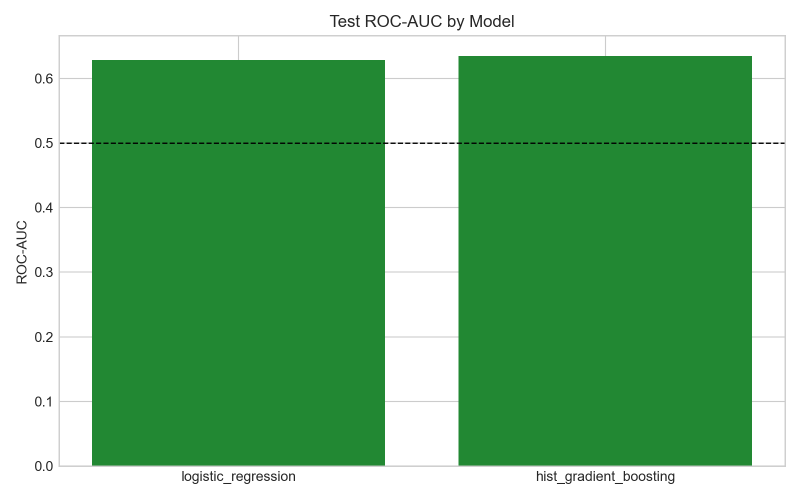
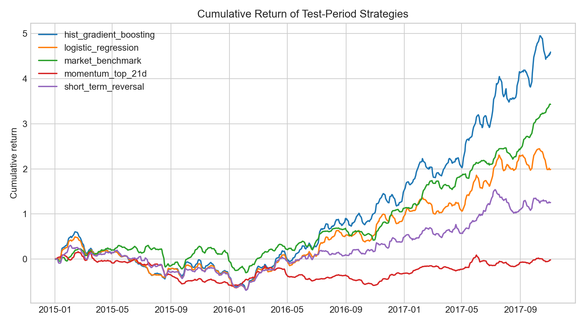
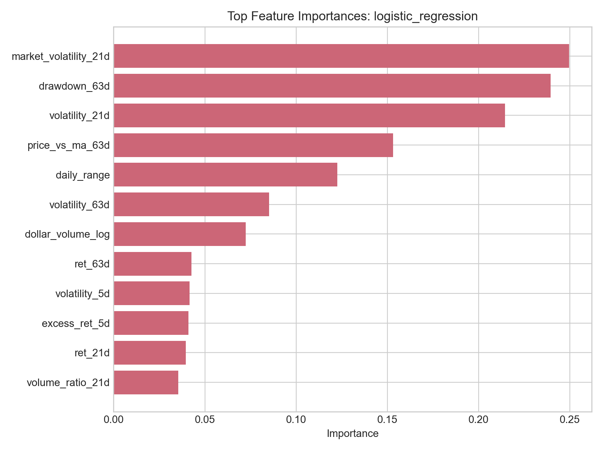

# Research Question

Can historical price and volume patterns predict which U.S. stocks and ETFs will rank in the top 20% of future five-day returns?

Why this matters:

- Investors often use technical signals.
- Many apparent market patterns are weak or unstable.
- A rigorous data science workflow can test signal vs. noise.

# Data

Kaggle Huge Stock Market Dataset:

- 17,078 stock and ETF price files in the downloaded archive.
- Daily `Open`, `High`, `Low`, `Close`, and `Volume`.
- Prices adjusted for dividends and splits.
- Main analysis uses a liquid universe of major stocks and ETFs.

Final cleaned analysis:

- 1,412,252 raw rows loaded.
- 230 assets retained after filters.
- 679,803 model-ready asset-date rows.

# Modeling Frame

We predict a cross-sectional target:

An asset is labeled positive if its future five-day return ranks in the top 20% among all assets on the same date.

Leakage controls:

- Features use only information available at date `t`.
- Future return target uses `t + 5`.
- Train, validation, and test sets are split by time.

# Feature Groups

- Momentum: 1, 5, 21, and 63-day trailing returns.
- Risk: rolling volatility and 63-day drawdown.
- Volume: volume ratio and volume z-score.
- Liquidity: log dollar volume.
- Price behavior: daily range, gap return, open-to-close return.
- Market context: SPY return and volatility when available.

# Daily Returns Are Noisy

# Momentum Test

The lowest past-momentum quintile had the highest average future five-day return, suggesting short-term reversal was stronger than continuation momentum in this universe.

# Model Results

Test ROC-AUC:

- Logistic regression: 0.628
- Histogram gradient boosting: 0.635
- Random benchmark would be about 0.500

# Backtest

Strategy:

- Rank assets by predicted probability.
- Select top 25.
- Equal-weight portfolio.
- Subtract 0.10% transaction cost.

# Feature Importance

The most important signals were market volatility, drawdown, rolling volatility, moving-average distance, and daily range.

# Main Conclusion

Price and volume signals contain weak but measurable information about short-term relative performance.

But the project does not show an easy path to guaranteed trading profit:

- Predictive signal is modest.
- Active strategies had high volatility and large drawdowns.
- The market benchmark had the best Sharpe ratio.
- Transaction costs and risk matter.

# Limitations and Next Steps

Limitations:

- Dataset ends in 2017.
- Possible survivorship bias.
- No fundamentals, sectors, macro data, or news.
- Simplified transaction costs.

Next steps:

- Add fundamentals and sector labels.
- Update through current data.
- Test walk-forward retraining.
- Compare stocks and ETFs separately.

